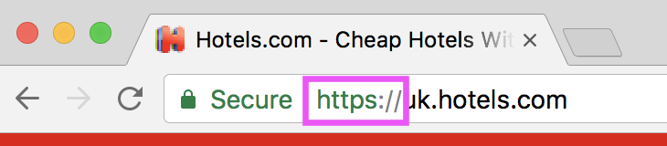

When you type a _web address_ in the browser and press _enter_ a lot of things have to happen before you can see the web page.

Let's go step by step thought this process.

## HTTP(s)

The first step is to request the desired _web page_.
The browser will communicate the _web address_ to whe _web server_ through **HTTP** (Hypertext Transfer Protocol).



This _protocol_ is nothing more than a standardised language to handle request and response of online resources.

In the example above we are just making a **GET** request to the _hotels.com_ homepage.

In plain english it would be something like:

> Hey hotels.com server, I would like to receive the content of the homepage

Similarly we can request other pages, like `hotels.com/profile/signin.html`.

In this case we are saying something like:

> Hey hotels.com server, I would like to receive the sign in page

Usually the server will answer with some **HTML**

## HTML

An HTML (Hypertext Markup Language) page is nothing more than a text file containing our content surrounded by tags.

> HTML describes the structure of a web page semantically and originally included cues for the appearance of the document. (Wikipedia)

```html
<!DOCTYPE html>
<html lang="en">
<head>
    <title>My Amazing Page</title>
    <style>
        h1 {
            color: red;
        }
    </style>
</head>
<body>
    <h1>My amazing title</h1>
    <p>My amazing paragraph</p>
    <script>
        console.log('ciao!')
    </script>
</body>
</html>
```

This is a typical HTML page structure. When we receive this text from the server, the browser will parse it from top to bottom.

The HTML `<head>` element provides general information (metadata) about the document, including its title and links to its scripts and style sheets.

The HTML `<body>` element represents the content of an HTML document.

The HTML `<script>` element is used to embed **JavaScript** code.

The order of declaration is very important for the proper functioning of the _web page_.

## CSS

CSS (Cascading Style Sheets) is a style sheet language used to apply styles to the web pages, such font sizes, colors, margins and much much more.

The typical syntax is:

```css
h1 {
    font-size: 16px;
    color: blue;
}
```

## JavaScript

JavaScript ("JS" for short) is a full-fledged dynamic programming language that, when applied to an HTML document, can provide dynamic interactivity on websites.

> JavaScript is incredibly versatile. You can start small, with carousels, image galleries, fluctuating layouts, and responses to button clicks. With more experience you'll be able to create games, animated 2D and 3D graphics, comprehensive database-driven apps, and much more! (MDN)

These are the main blocks that compose the **World wide web**

---
### Further readings
* [HTML](https://developer.mozilla.org/en-US/docs/Glossary/HTML)
* [CSS](https://developer.mozilla.org/en-US/docs/Web/CSS)
* [JavaScript](https://developer.mozilla.org/en-US/docs/Learn/Getting_started_with_the_web/JavaScript_basics)