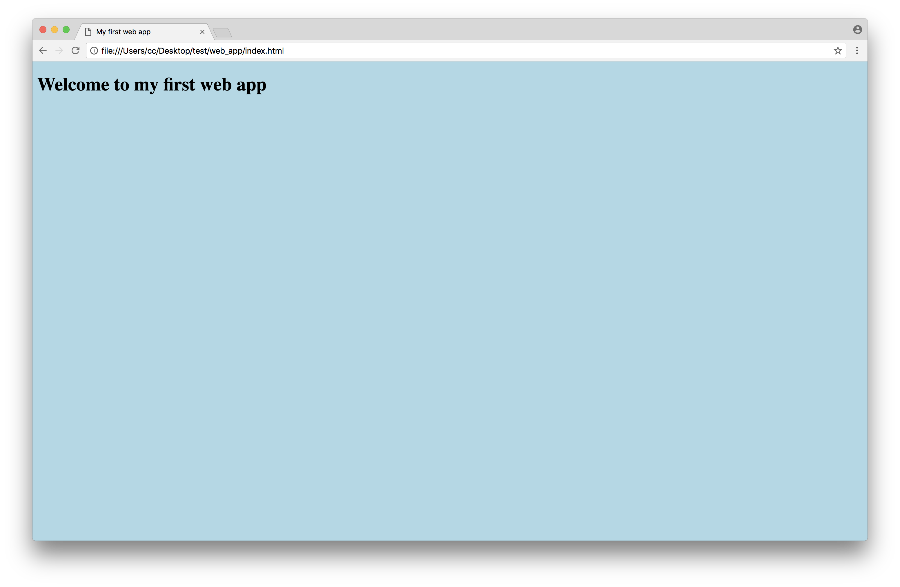

Setting a new web application is a straightforward process.
All you need is:

* A [Web Browser](https://browsehappy.com) 
* A [code editor](https://code.visualstudio.com/Download)


## Project structure

Create a new folder called **web_app** and open it in the code editor of your choice.

Once opened create __three files__ in the root of the folder:

* index.html
* style.css
* app.js


## HTML base structure

Copy and paste the following _HTML_ code in **index.html** file:

```html
<!DOCTYPE html>
<html lang="en">
<head>
    <meta charset="UTF-8">
    <meta name="viewport" content="width=device-width, initial-scale=1.0">
    <meta http-equiv="X-UA-Compatible" content="ie=edge">
    <meta name="description" content="My first HTML page">
    <title>My first web app</title>
</head>
<body>
    <h1>Welcome to my first web app</h1>
</body>
</html>
```

If you open _index.html_ file in your browser you should see something like this:


## Link the style sheet file (style.css) to the page

To link the style sheet file to the web page, edit the _index.html_ in order to contain a link to **style.css**

```html
<!DOCTYPE html>
<html lang="en">
<head>
    <meta charset="UTF-8">
    <meta name="viewport" content="width=device-width, initial-scale=1.0">
    <meta http-equiv="X-UA-Compatible" content="ie=edge">
    <meta name="description" content="My first HTML page">
    <title>My first web app</title>
    <link rel="stylesheet" href="style.css">
…
```

Before previewing our changes let's add some custom style to **style.css** file:

```css
body {
    background-color: lightblue;
}
```

If you open again _index.html_ file in your browser you should see something like this:



## Link the JavaScript file (app.js) to the page

To link the JavaScript file to the web page, edit the _index.html_ in order to contain a link to **app.js**

```html
…
    <h1>Welcome to my first web app</h1>
    <script src="app.js"></script>
</body>
</html>
```

> N.B. It's important to insert the _JavaScript_ reference before the `</body>` closing tag.

Let's now add some _JavaScript_ code to **app.js** file:

```js
alert('Welcome to my app!')
```

If you open again _index.html_ file in your browser you should see something like this:


## Use the Browser Console to debug JavaScript

Another fundamental tool for a _Web Developer_ is the **JavaScript Console**.

Let's add some _JavaScript_ code to our **app.js** file:

```js
alert('Welcome to my app!')

console.log('Hello world!')
```

In order to see our message, we will need to open the **JavaScript Console**.

_Right click_ on the web page and select **inspect**; in the panel you've just opened select the **console** tab, your message should be now visible:


