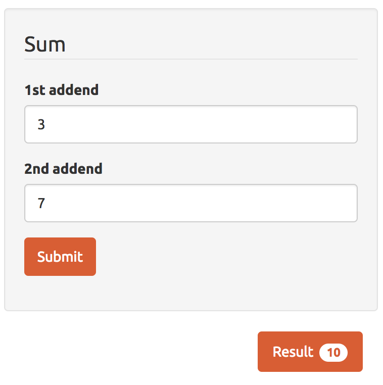

What is a **program**?
> A program is a series of instructions that can be put into a computer in order to make it perform an operation

Usually every program starts with one or more inputs and you need to execute some operation on top of them to achieve your goal.

For example, let's imagine to have a web form like this:



Your _inputs_ are the two addends, and all you want to do with them is just to calc their sum.

Your program should do something like this:

```
READ the input form the page
SUM the inputs
WRITE the sum result in the page
```

These lines above are written in  _pseudo code_, more similar to plain english than to a real programming language.

To be able to run this program in a web browser we need to translate it in _JavaScript_, but in order to do so we will need to introduce some fundamental concept first.

The first question we will answer is: "What kind of data can I use in JavaScript?"

## Types

In JavaScript the following built-in types are available:

* `string`
* `number`
* `boolean`
* `object`
* `null` and `undefined`

### String
A string is just a piece of text, can be composed by one or more letters and it has to be wrapped in with single or double quotes (you can't mix them)

```js
'h'
'hello'
```

You can also have spaces in strings, or any kind of special characters:

`'hello world! ` :wink:`'`

Of course you can also have numbers in strings, but pay attention, that is still a string and not a number:

```js
'I have 3 apples'
```

### Number

A number is… a number :laughing:, can be an _Integer_ or a _Floating point_ number and it should not be wrapped within quotes:

```js
45
9.9
10e2
```

### Boolean
A boolean can be just true or false and is defined as a _logical operator_, it doesn't need to be wrapped with quotes and please remember that 'false' is just a string and it is different from false the boolean value:

```js
true
false
```

### Object
The object type refers to a compound value where you can set properties (named locations) that each hold their own values of any type:

```js
{
    a: 'hello world',
    b: 42
}
```

### Null and undefined
The value `null` represents the **intentional** absence of any object value:

```js
null
```

The value `undefined` represents the absence of any object value:

```js
undefined
```

These was just a quick overview of all the types available in Javascript, but don't worry, we will go back to this subject soon.

## Variable
Most of the time we will need to store our data somewhere in order to use them later, to accomplish this in JavaScript we use the `var` statement:

```js
var myName = 'Guybrush'
```

Now the string `'Guybrush'` is stored in the 'myName' variable and I can use later to do any kind of operation.
Of course we can store any kind of data in variables:

```js
var myAge = 33
var mySkills = {
    mightyPirate: true
}
var myFavouriteColour = blue
```

To declare a variable we just have to follow few rules:

* Start with `var`
* The name of the variable **must not** contain spaces
* The name of the variable **must not** start with a number
* The value **must** be precede by a single `=` symbol

Once we have stored a value in a variable we can always change it:

```js
myFavouriteColour = green
```

Did you notice any difference? This time we didn't type the `var` keyword. That's because we already declared the `myFavouriteColour` variable previously and now we just want to change its value.

But what if you have some kind of data that you already know will never change?
For example it's unlikely that your name is going to change. In this case we can declare our variable using the `const` statement:

```js
const myName = 'Guybrush'
```

This is equivalent to use the `var` keyword with the only difference that now it will not be allowed to change the variable value.

## Operators
An Operator is a symbol (such as +, −, ×, etc) that shows an operation (i.e. you want to do something with the values).

In Javascript we have several types of operator but let's focus on the main ones for now

### Comparison operators
This operator will compare two values and it will return a _boolean_ (`true` or `false`) on whether the comparison is true.

Let's start by declaring two variables:

```js
const a = 1
const b = 2
```

### Equal (==)

Returns true if the operands are equal.

```js
a == a // true
a == b // false
```

### Not Equal (!=)

Returns true if the operands are not equal.

```js
a != b // true
a != a // false
```

### Greater than (>)

Returns true if the left operand is greater than the right operand.

```js
a > b // false
b > a // true
```

### Less than (<)

Returns true if the left operand is less than the right operand.

```js
a < b // true
b < a // false
```

For a full list of [Comparison Operators click here](https://developer.mozilla.org/en/docs/Web/JavaScript/Guide/Expressions_and_Operators#Comparison_operators)

### Arithmetic operators
An arithmetic operator takes numerical values (either literals or variables) as their operands and returns a single numerical value.

The standard arithmetic operators are addition (+), subtraction (-), multiplication (*), and division (/).

```js
const a = 1
const b = 2

a + b // 3
a - b // -1
a * b // 2
a / b // 0.5
```
---

These may look very simple topics, but we will see in the next lessons how these basic concepts can be transformed in complex programs!

Now let's jump to the exercise:

[Go to the exercise page](https://jsbin.com/nopoba/edit?js,output)

---
### Further readings
* [Expressions and operators](https://developer.mozilla.org/en/docs/Web/JavaScript/Guide/Expressions_and_Operators#)
* [Into Programming](https://github.com/getify/You-Dont-Know-JS/blob/master/up%20%26%20going/ch1.md)