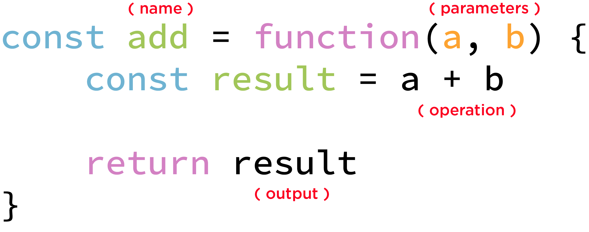

In the previous lesson we have seen the main _JavaScript_ types. In this lesson we are going to analyse in-depth the _Object_ type and its subtypes.

## Object

>Object refers to a data structure containing data and instructions for working with the data. [[MDN](https://developer.mozilla.org/en-US/docs/Glossary/Object)]

In other words an _Object_ is a data container that usually is a representation of a real-world thing, like an animal.

```js
const penguin = {
    name: 'Penguin',
    habitat: 'South Pole',
    height: 110
    pic: '🐧'
}
```

Each name/value pair is called _property_ (eg. `name: 'Penguin'`).

All the _properties_ must be wrapped in _curly brackets_ and separated by _comma_.

An _Object_ property can contain any kind of value, like `string`, `number`, `boolean` or even another `object`.

To **get** the value of a property from an object you have two options:

The _dot notation_
```js
penguin.height // 110
```
Or using _square brackets_
```js
penguin['height'] // 110
```

In a similar way you can also **set** a _property value_:
```js
penguin.height = 100

penguin.height // 100
```

or

```js
penguin['height'] = 100

penguin['height'] // 100
```

## Array

> An array is an ordered collection of data (either primitive or object depending upon the language). Arrays are used to store multiple values in a single variable. This is compared to a variable that can store only one value. [[MDN](https://developer.mozilla.org/en-US/docs/Glossary/Array)]

In _JavaScript_ an Array is a special type of _Object_. The main purpose of an _Array_ is to store ordered data.
Let's imagine you want to store some animals ordered by height. Using normal _Objects_ would be difficult to have a quick way to get the tallest.
That's a perfect scenario to use an _Array_.

```js
const animalsOrderedByHeight = [
    'Elephant',
    'Penguin',
    'Cat'
]
```

All _Array items_ must be wrapped in _square brackets_ and separated by _comma_.

An _Array item_ can contain any kind of value, like `string`, `number`, `boolean`, `object` or even another `array` (multi dimensional _Array_).

```js
const animalsOrderedByHeight = [
    {
        name: 'Elephant',
        habitat: 'Savannah',
        height: 300,
        pic: '🐘'
    },
    {
        name: 'Penguin',
        habitat: 'South Pole',
        height: 110
        pic: '🐧'
    },
    {
        name: 'Cat',
        habitat: 'Sofa',
        height: 25,
        pic: '🐱'
    }
]
```

Each _item_ of an _Array_ has an **index** position starting from **0**.

To **get** a value out of an _Array_ you need to know its **index**.

```js
const elephant = animalsOrderedByHeight[0]
const cat = animalsOrderedByHeight[2]
```

In a similar way you can also **set** an _item_

```js
animalsOrderedByHeight[3] = {
    name: 'Snail',
    habitat: 'Most of the world',
    height: 1,
    pic: '🐌'
}
```

Now combining with what we learnt previously about retrieving an _Object_ property:

```js
animalsOrderedByHeight[3].name // 'Snail'
```

Of course we have a lot of powerful tools to work with _Objects_ and _Arrays_ in _JavaScript_, but we first need to introduce the _Function_ concept.

## Function

> JavaScript functions perform actions; they can also return values. Sometimes these are the results of calculations or comparisons. [[Microsoft Docs](https://docs.microsoft.com/en-us/scripting/javascript/functions-javascript)]

A _Function_ is a fundamental block of programming. It's a **set of instructions** that performs a precise action.
Usually a _function_ takes one or more **inputs** values and, after processing them, it **returns** only one value.

Imagine a vending machine, you insert a coin (the **input**), the machine makes some operations and it releases you back food (the output or the **return**).
The vending machine is your _Function_, and all the gears required to release food are your _operations_.


Like any other _type_ in _JavaScript_, you can store a _Function_ inside a variable. 

To write a function you just need to start your statement writing the word **function**, then in parenthesis you need to declare the required **parameters** (the inputs); finally wrap the operations in **curly brackets**.

Inside the **curly brackets** you are in the _Function scope_, a special space that is not accessible from the outside world (called _global scope_), but we are going to talk more in depth about the _scope_ in a future lesson.

Inside the _function scope_ you can make all the operations required to achieve a result; once you have it you need to *return* it.



Now that you have stored your operations inside a _function_, you can call them whenever you need just by executing the _function_.

To execute the function you need to use the name of the _variable_ where you stored it. Now, **without adding any white space**, you need to pass a comma separated list of _parameters_, wrapped in parenthesis, to the function.

```js
const multiply = function(a, b) {
    const result = a * b

    return result
}

multiply(2, 3) // 6
```

This is a powerful concept and to fully understand it some practice is required, so let's jump to the exercises.

[Go to the exercise page](https://jsbin.com/zurijah/edit?js,output)

---
### Further readings
* [Object and Array definition](https://docs.microsoft.com/en-us/scripting/javascript/objects-and-arrays-javascript)
* [Function definition](https://developer.mozilla.org/en-US/docs/Glossary/Function)
