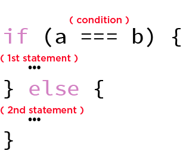

We are almost ready to start writing our first web app, but first, we will need some more tool.

## If…else
As we have already said, every software starts from some kind of input. But what if we want to trigger a different action conditionally to the input value?

For such scenario we can use the **if…else** statement.

> The if statement executes a statement if a specified condition is truthy. If the condition is falsy, another statement can be executed. [[MDN](https://developer.mozilla.org/en-US/docs/Web/JavaScript/Reference/Statements/if...else)]



Let's imagine to have two _variables_ each containing a different hotel _object_ :

```js
const hotelA = {
    name: 'Amazing Luxury Hotel',
    price: 1000
}

const hotelB = {
    name: 'Cool Cheap Hotel',
    price: 200
}
```

We want now to write a function that, given a _budget_, it returns a hotel cheaper than the given amount:

```js
const getHotelsInUserBudget = function(budget) {
    var result = null

    if (hotelB.price <= budget) {
        result = hotelB
    }

    if (hotelA.price <= budget) {
        result = hotelA
    }

    return result
}
```

Let's try this function in the [Demo page](https://jsbin.com/bomocot)

>**Quiz:** What would be returned by the function if the passed budget is _1_ ?

If we have multiple conditions we can use multiple **else if** statements:

```js
if(condition) {
    …
} else if (another condition) {
    …
} else {
    …
}
```

## The for loop
In software development is very common to work with ordered collections of data, what we called _Array_.
If we have a big array, containing several items, the only proficient way to use it is through a statement that let us to quickly iterate over its items.
This _statement_ in _JavaScript_, as well as in other programming language, is the **for loop** (or for statement).

> A for loop repeats until a specified condition evaluates to false. [[MDN](https://developer.mozilla.org/en-US/docs/Web/JavaScript/Guide/Loops_and_iteration#for_statement)]


The **for loop** is composed by the following part:
* The _initial expression_ : This will run only one time at the beginning of the execution, it usually initializes the _loop counter_
* The _condition_ : It will be evaluated at the begging of each loop iteration. If the value of condition is true, the loop statements execute. If the value of condition is false, the for loop terminates.
* The _final expression_ : It will be evaluated at the end of each loop iteration. Generally used to update or increment the counter variable.

> **Tip:** The **++** is the _Increment operator_. It's a simple operator that adds one to its operand.

Let's imagine to have an _array_ containing some hotel _objects_:

```js
const hotels = [
    {
        name: 'Luxury Hotel',
        price: 1000
    },
    {
        name: 'Cozy Hotel',
        price: 500
    },
    {
        name: 'Nice and Cheap Hotel',
        price: 200
    }
]
```

We want now to write a function that, given a _budget_, it returns a hotel cheaper than the given amount:

```js
const getHotelsInUserBudget = function(budget) {
    var result = null;

    for (var index = 0; index < 3; index++) {
        if (hotels[index].price <= budget) {
            result = hotels[index]
        }
    }

    return result
}
```

This function will iterate through the hotels _array_ and it will return the cheaper hotel in the user budget.

> **Tip:** All the _arrays_ have the property **length** that contains the number of items in it.

The current version of the function is not perfect, and we can improve it in order to be more useful and generic, let's see how in the [Demo page](https://jsbin.com/xavopaw).

[Go to the exercise page](https://jsbin.com/zurijah/edit?js,output)

---
### Further readings

