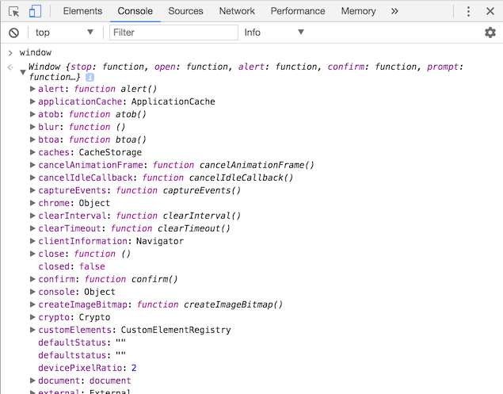
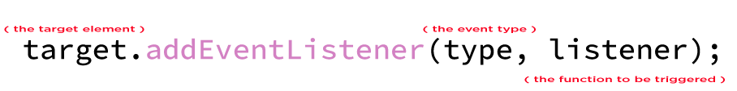

When you are working with JavaScript in the browser, you have access to a wide set of functions to interact with the page.

## The Window object

The **window** object is the global object that is automatically created by the browser when you open a new page.

This _object_ contains a set of properties and functions helpful to make the page interactive.

> Task: Open the _Developer Tools_ on this page, type _window_ in the console and press enter.



> Tips: To open the _Developers Tools_ right click anywhere on the page and select _inspect_.

Let's try a couple of useful functions that we can find in this object.

> Task: Try to run this function in the _console_: `window.alert('Hello world!')`

The _alert_ function is a simple function the will display an alert dialog containing the passed _string_.

> Task: Try to run this function in the _console_: `window.console.log(3 > 2)`

The _console.log_ function will print a message in the console.

### window.document

This property contain a reference to the _HTML_ document and also a set of functions to interactive with it.

> Task: Inspect the `window.document` object within the console.

The content of `window.document` is a list of _elements_ (or _nodes_, a node is the _JavaScript_ representation of a _HTML_ tag).

### Select a specific element

We have multiple ways to select an element in the page.

The easiest way is trough an ID.

```html
<!DOCTYPE html>
<html lang="en">
<head>
    <title>My Amazing Page</title>
</head>
<body>
    <h1 id="my-title">My amazing title</h1>
    <p>My amazing paragraph</p>
</body>
</html>
```

In this example the `<h1>` element has the _my-title_ ID.

To select this element in _JavaScript_ we can do:

```js
const theTitleElement = document.getElementById('my-title')
```

now the constant _theTitleElement_ will contain a reference to that specific element.

we can now for example, change the colour of the text:

```js
theTitleElement.style.color = 'red';
```

[Go to the exercise page](https://jsbin.com/mofayaz/3/edit?html,js,output)

> Task: by only inspecting the _document_ object, can you spot any other functions to **get** an element in the page?

### Add an event listener

So far we have manually triggered actions by executing functions directly in the browser _console_.

In the real world is the user that should trigger actions in the _web page_.

To do so we need to add an _event listener_ to some element. This way we will be ready to execute some function when the user will interact with those element.

```html
<!DOCTYPE html>
<html lang="en">
<head>
    <title>My Amazing Page</title>
</head>
<body>
    <button id="my-button">Click me!</button>
</body>
</html>
```

Let's imagine to have the above situation. We want to open an alert dialog when the user click the button.

First we store our element in a variable:
```js
const openDialogButton = document.getElementById('my-button');
```

Then we declare our function:
```js
const sayHello = function() {
    alert('Hello')
}
```

And finally we add the event listener to the element:
```js
openDialogButton.addEventListener('click', sayHello)
```



> Task: Search on Google what types are available.

[Go to the exercise page](https://jsbin.com/mohicac/edit?html,js,output)

---
