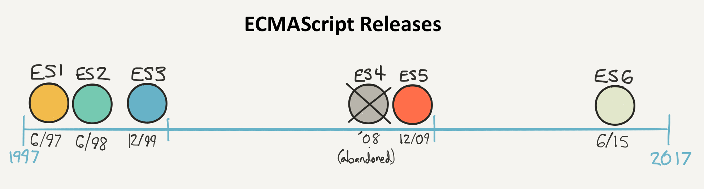

The **web** in the early 90's was very different, simple pages rich of content but poor of interaction, something like [this](assets/netscape1996_big.png) or like [this](assets/exp1997_big.png).

The web needed some programming language to let developers to make web pages interactive, possibly something easy enough to allow everyone to use it. At the time HTML was quite simple and the upcoming language should be used by the same audience.

So [Netscape](https://en.wikipedia.org/wiki/Netscape), creator of _Netscape Navigator web browser_ and one of the largest web companies at the time, created JavaScript in 1996. Of course the competitors tried to create something similar for their browsers (eg. Internet Explore ) causing a lot of confusion in the community. Luckily _Netscape Navigator_ was the most common browser at the time, and after few time JavaScript became the de-facto standard.

In the following years, **Microsoft Internet explorer** was greatly increasing in popularity, and the importance of JavaScript was too great to leave its future development in the hands of the competing browser developers. So, in 1996, JavaScript was handed over to an international standards organization called **Ecma International** (_European Computer Manufacturers Association_), who then became responsible for the subsequent development of the language.

As a result, the language was officially renamed **ECMAScript** or ECMA-262, but most people still refer to it as JavaScript. 

The first version of ECMAScript widely used was the 3d (AKA ES3) released in 1999, to see another released we need to wait until 2009 with ES5 (yeah we skipped ES4, but that's another story). ES5 is the version of javascript that is fully supported by all the browser out in the wild.

From 2009 a lot of things have changed. We now have a lot of very complex app running directly in the browser, and JavaScript is being used also as a server side language ([NogeJS](https://nodejs.org/en/)). In this new scenario ES6 was released (2015) and that's where we are starting, **ES6 will be the language that you will learn in this course**.

Javascript is going to change faster in the future, a new release every year, ES7 is already a standard and all browser are starting to implement it.

[Go to Lesson1](lesson1.html)

---
### Further readings
* [A brief history of JavaScript](https://auth0.com/blog/a-brief-history-of-javascript/)
* [The Real Story Behind ECMAScript 4](https://auth0.com/blog/the-real-story-behind-es4/?utm_source=medium&utm_medium=sc&utm_campaign=es4)